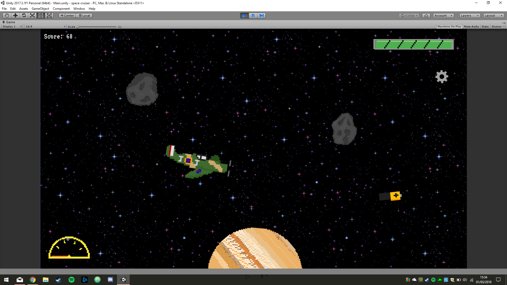

# **Astro Rider**

Astro Rider is a retro game which aims to both entertain and educate players through a fast paced tour of our solar system.

Players enhance their vehicles with collected resources in order to progress towards more distant planets. The game ends with a mission report summarising all intel gained during the exploration.

The journey begins at the Moon and progresses away from the Sun, eventually concluding at Neptune. Six different 'space craft' are unlocked throughout the game, including an X-Wing Starfighter.

### CSS Boeing 24hr Space Hackathon 2018

This game was developed in Unity by Nuha Tumia, Jack Jones, Louis Heath and Tom Walker, including all assets excluding the background and SFX.
